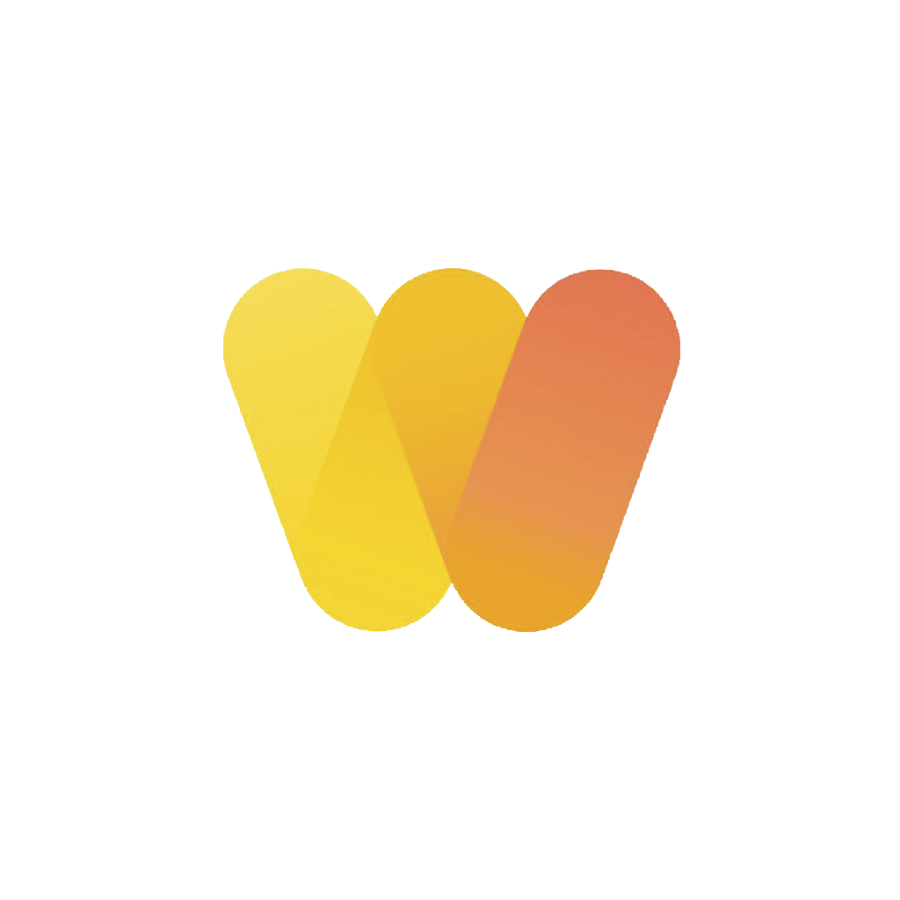

<h1>WeeDoo</h1>

WeDo is cool and good.

<h2>Screenshots</h2>

   

## Expo  
Scan the code. 🏁 Run the app! 🏃‍♂️  

| 🤖 Android | 🍎 IOS |  
|----|----| 
|  |  |

## Tech Stack

- Made *fast* with [React](https://reactjs.org/)
- Made *mobile* with [React Native](https://reactnative.dev/)
- Made *mobile**r*** with [Expo](https://expo.dev/)
- Made *stylish* with [React Native Elements](https://reactnativeelements.com/)
- Made *stylish**er*** with [Styled Components](https://styled-components.com/)
- Made *navigational* with [React Navigation](https://reactnavigation.org/)

Опа, вот я говорю на русском  
Poof, English now  
Και τώρα ελληνικό. Απροσδόκητο, σωστά;  

<b> hold up 👷‍♀️ </b>

